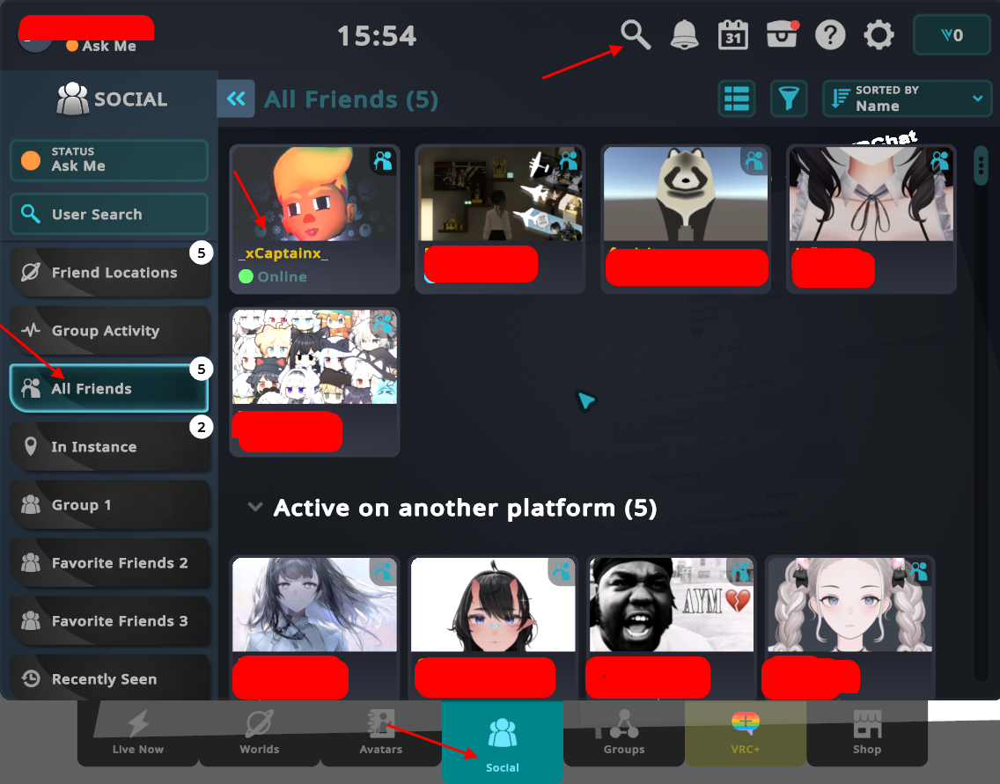
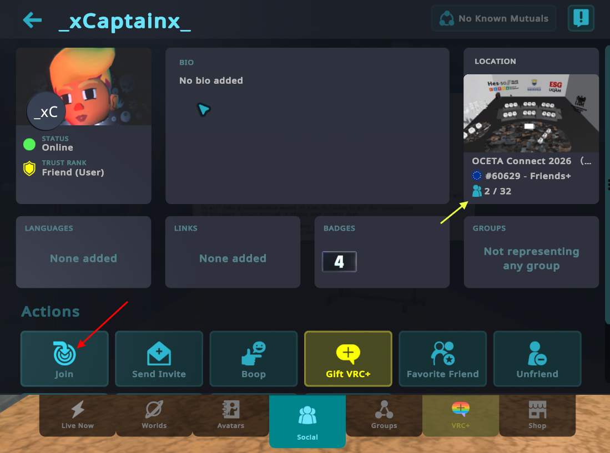
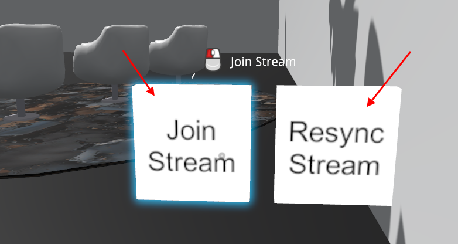
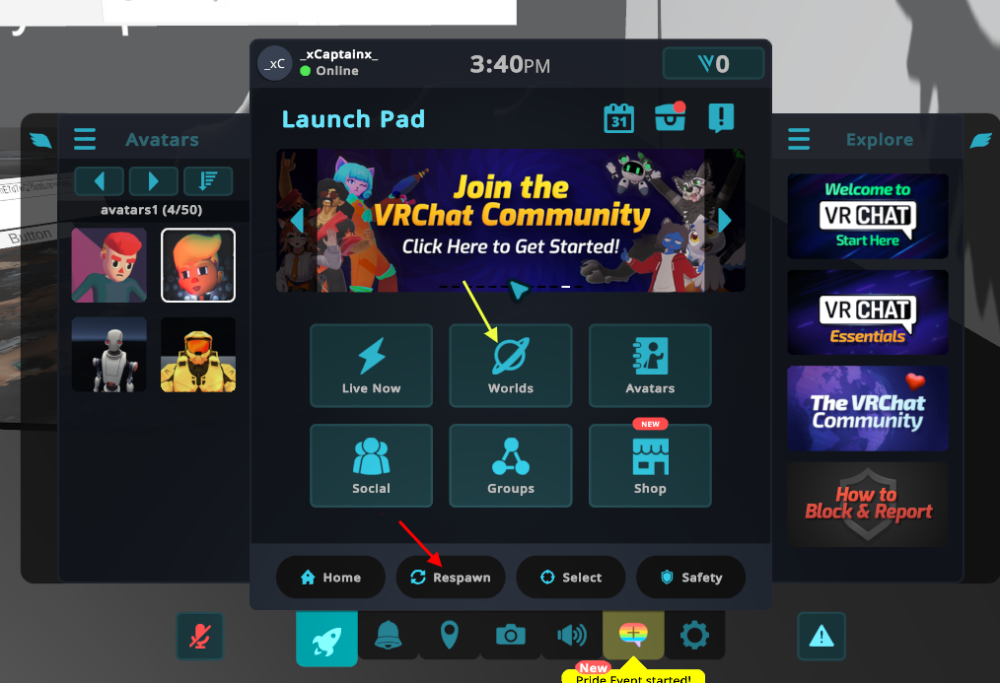
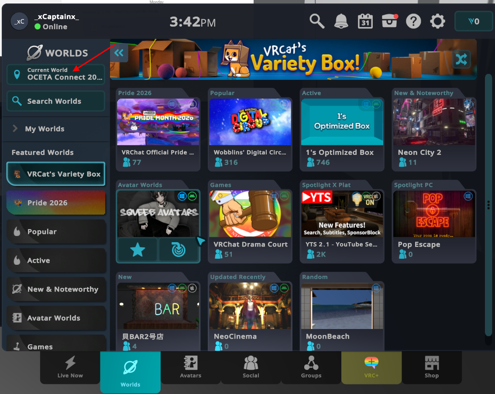
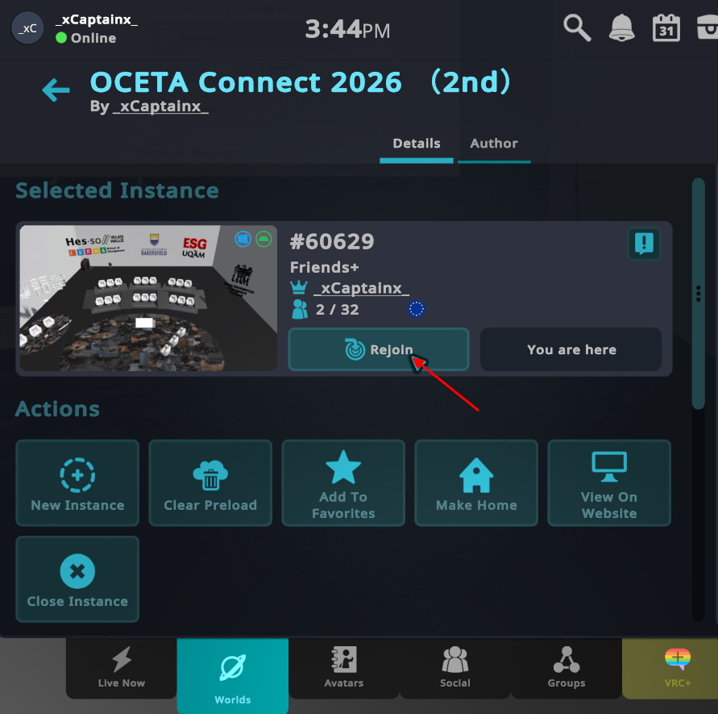
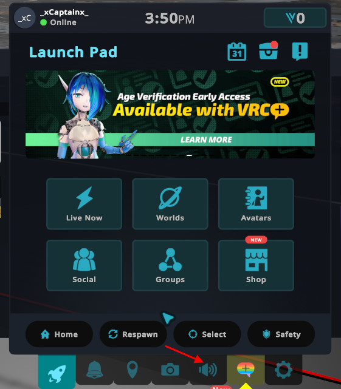
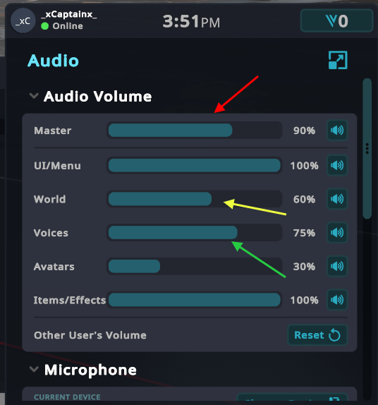

# Guide 6: VR Chat Must Know

### Joining the OCETA Arena world

If I am not your frind on VR Chat yet, send me the friend request.
Search for me (username: **_xCaprainx_**) (red arrow and send me friend request), and if we are already friends, click my icon in the Social menu "All Friends"

 and click "Join".

### In case of problems with presentation video screen in VRChat world 

Might happen that your video will be much delayed, frozen or lost. 
In this case try to resync your stream by using: 

#### Try to use "Rejoin Stream" or "Resync Stream" buttons on left side wall

#### or try to use a "Respawn" function (red arrow) in the Menu

#### or try to use a "Rejoin" function in the Menu

In Main Menu click Worlds button (yellow arrow on previous image). Then click "Current World" button (red arrow on following image).

Then click Rejoin button for current world

### In case of problems with Audio

In Menu click on the Speaker icon (red arrow).

Then adjust respective Volume slider

Master is for all sounds. 
World is for world sounds like presentations video player etc. 
Voices is for other players' avatar voices.
 

