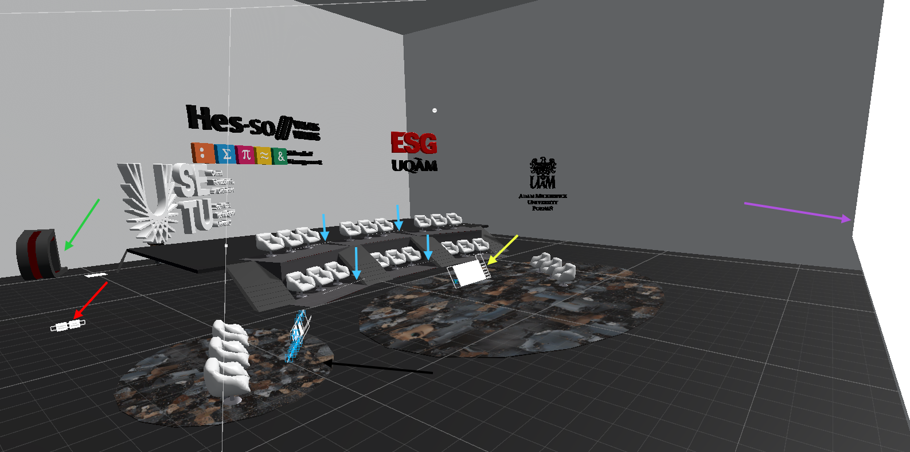
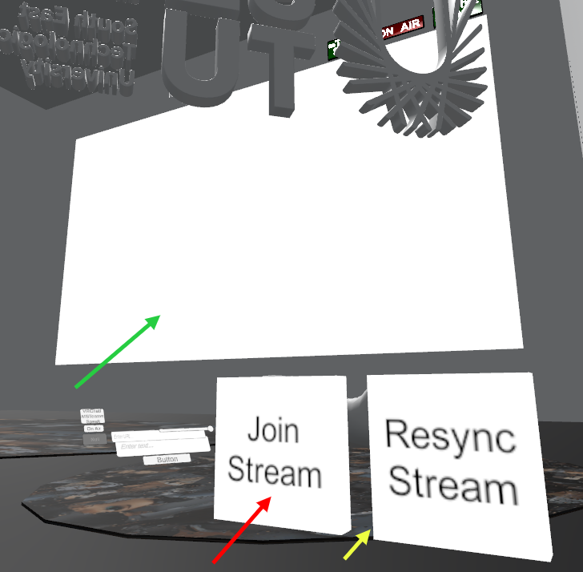
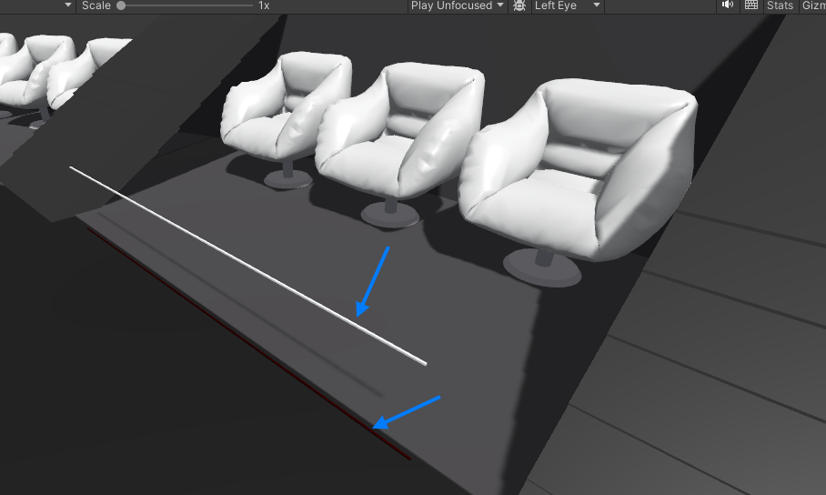
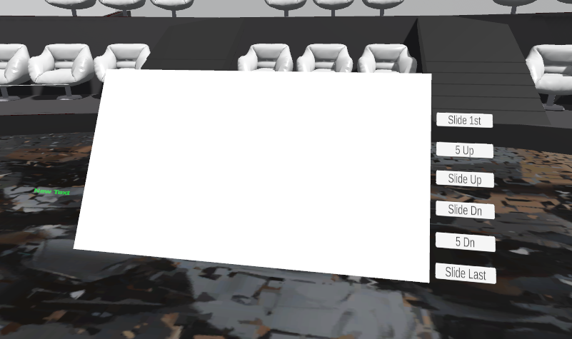
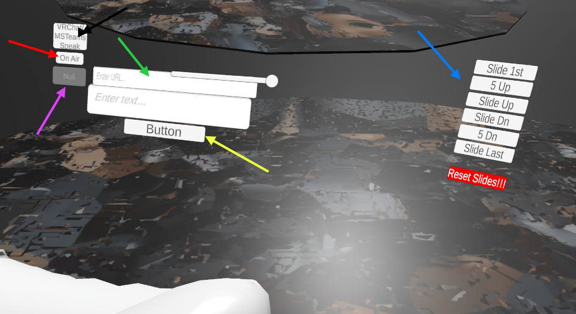

# OCETA Arena Map

1.​ OCETA Arena Join Spawn Point (green arrow). 
2.​ Presentation Screen activation buttons (Join Stream & Resync Stream) (red arrow). 
3.​ Presentation Screen (purple arrow). 
4.​ Audience Seats and Speak Aloud activation white-red lines (blue arrow). 
5.​ Speakers Area with indirect slides control buttons and presentation preview screen (yellow arrow). 
6.​ OCETA Operators Area (black arrow).

# After you join VR Chat OCETA Arena

1.​ After you join OCETA Arena in VRChat.  
2.​ Continue to activate the Presentation Screen by clicking on the "Join Stream" button so the

screen on the front wall will show up. In case of synchronisation problems (slides should be visible on the screen but are not) please click the "Resync Stream" button. If this will not help, please try "Join Stream/Resync Stream" buttons again or rejoin the VRChat instance again. If the problem persists, please join the OCETA MS Team meeting.

---

3.​ Presentation Screen (green arrow). ​

​

---

4.​ Audience Seats and Speak Aloud activation white-red lines (blue arrow). ​

​
5.​ Speakers Area with indirect slides control buttons and presentation preview screen ​

​
6.​ OCETA Operators Area

---

* Who speaks indicator (black arrow). 
* On Air indicator (red arrow). 
* Start/Reset Timer button (purple arrow). 
* Youtube Live Stream URL field (green arrow). 
* Message board text field and button (yellow arrow). 
* Slides Control buttons (blue arrow). ​ 
​

