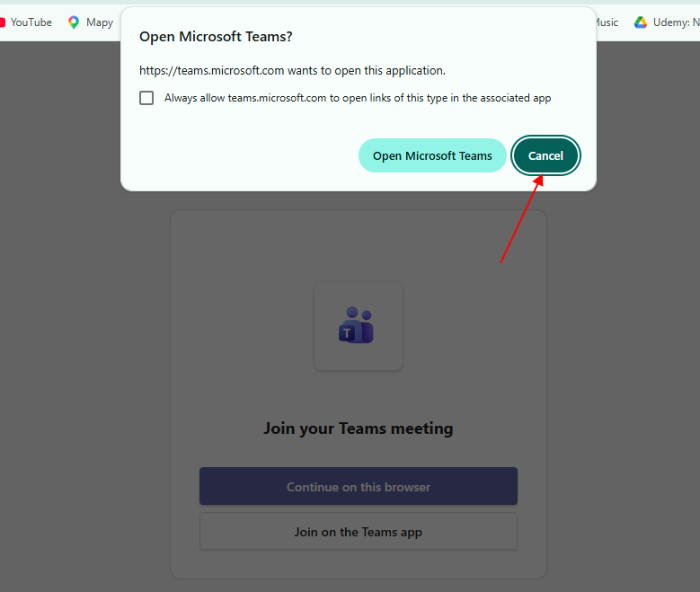
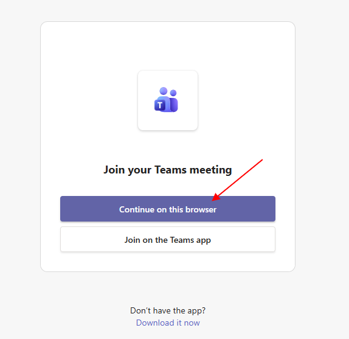
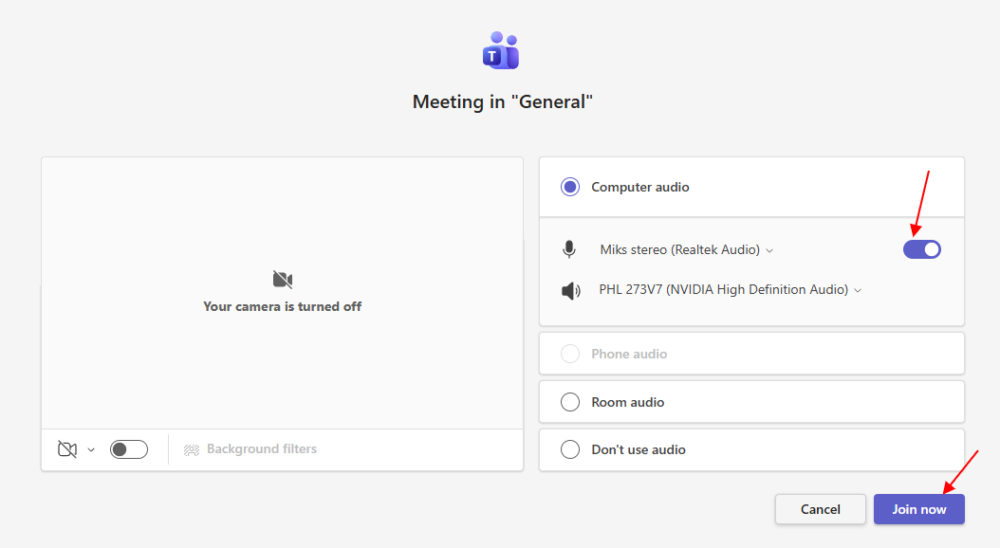
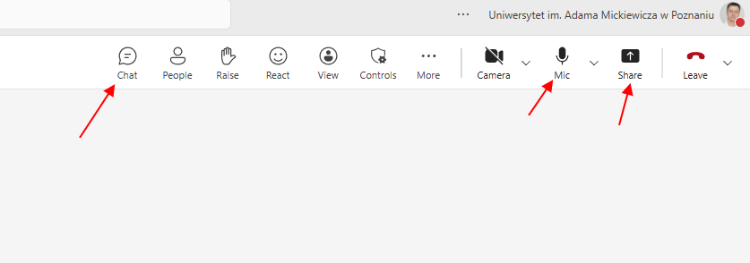
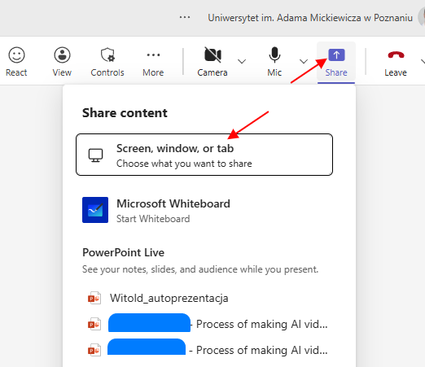
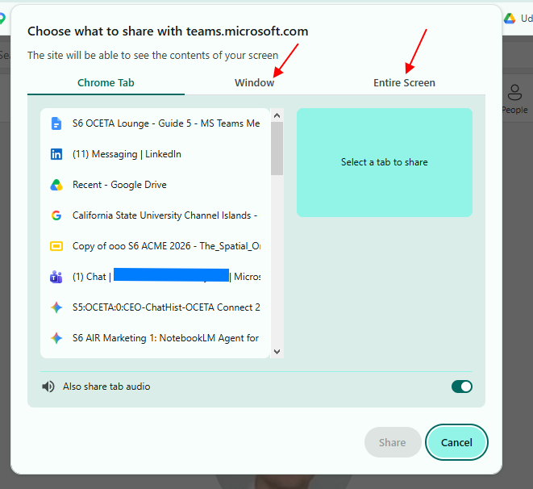
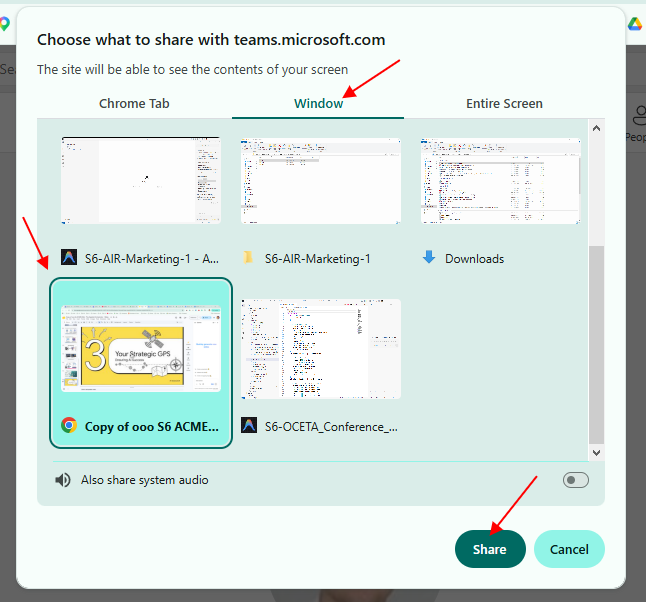
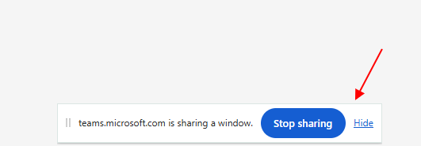

# Guide 0 - MS Teams Participants

[If you have any questions ask:](mailto:czart@amu.edu.pl) [czart@amu.edu.pl](mailto:czart@amu.edu.pl)

## Introductory video guides:

1. [How to Join Microsoft Teams Meeting as Guest (No Account Required 2026)](https://www.youtube.com/watch?v=dWSxSfCZlFQ) 
2. [Screen Sharing in Teams](https://www.youtube.com/shorts/4DoLIctlh1Q) 

### How to connect to the OCETA meeting

_________________________________________________________________________
Microsoft Teams meeting

[Join:](https://teams.microsoft.com/meet/392331435889291?p=xa4FmJ1zSUT5nhzUad) [https://teams.microsoft.com/meet/392331435889291?p=xa4FmJ1zSUT5nhzUad](https://teams.microsoft.com/meet/392331435889291?p=xa4FmJ1zSUT5nhzUad)

Meeting ID: 392 331 435 889 291

Passcode: S65xT2UJ

[Need help?](https://aka.ms/JoinTeamsMeeting?omkt=en-US)  [|](https://teams.microsoft.com/l/meetup-join/19%3anbOz9e0lMqp_xePd1XjyIKPgOVI3vY6SoHIrtNoUoPo1%40thread.tacv2/1782034190121?context=%7b%22Tid%22%3a%2273689ee1-b42f-4e25-a5f6-66d1f29bc092%22%2c%22Oid%22%3a%224eb7e274-21a0-4617-a4f5-dda769353b11%22%7d)  [System reference](https://teams.microsoft.com/l/meetup-join/19%3anbOz9e0lMqp_xePd1XjyIKPgOVI3vY6SoHIrtNoUoPo1%40thread.tacv2/1782034190121?context=%7b%22Tid%22%3a%2273689ee1-b42f-4e25-a5f6-66d1f29bc092%22%2c%22Oid%22%3a%224eb7e274-21a0-4617-a4f5-dda769353b11%22%7d)  
____________________________________________________________________________

---

1. Click "**Cancel** " to decline MS Teams standalone desktop application 

2. Click “**Continue**  **on**  **this**  **browser”** 

---

3. Set your **microphone**  access **ON,**  then click “**Join**  **now**” 

### Sharing your presentation

1. The most important icons/actions in the meeting window from the left: “**Chat**” - Open/Close Chat panel, “**Mic** ” - Microphone ON/OFF, “**Share** ” - to share your screen/presentation

---

2. To **Share** your presentation 

---

3. Select appropriate type of sharing 

4. Eg. “**Window** ” then select the window with presentation you want to share, and click “**Share**”

---

5. Then at the bottom of your screen you should see the stripe indicating that you are sharing your presentation.

