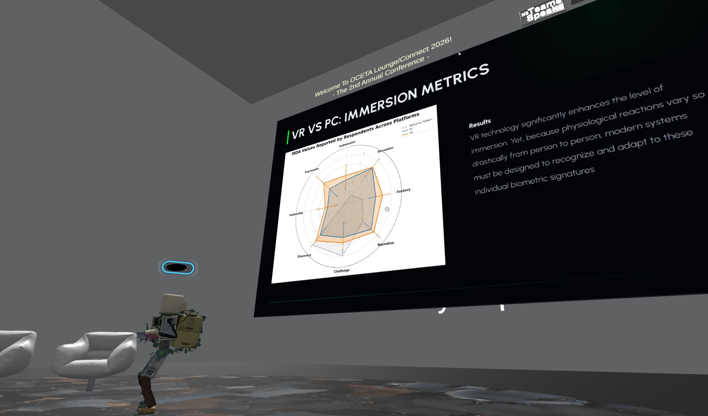
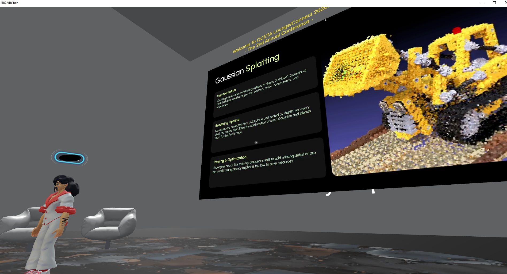

# OCETA Lounge 2026 - Program

**Date:**  11 June 2026  
**Time Zone:**  CEST (Central European Summer Time, UTC+2). Central European Summer Time 
(CEST) is exactly 9 hours ahead of Pacific Time.     
**VR Venue:**  OCETA Connect Arena (VRChat)   
**2D Screens Venue:**  Microsoft Teams Live Stream Hub  

### OCETA Lounge Audience Participants

* Joshua Rivera, California State University, Channel Islands 
* Ayaulym Akkulova, Abai University 
* Szymon Krakowski, Adam Mickiewicz University in Poznań 

### OCETA Lounge Presenters (Chronological Event Matrix)

| **CEST Time** (9 hours ahead of Pacific Time) | **Session / Presentation Title** | **Presenter & Affiliation** |
|---|---|---|
| **17:30 - 18:00** | **Technical Infrastructure & Setup Check** • AV routing and NDI capture stabilization. • Participant avatar performance vetting. | **OCETA Technical Team** |
| **18:00 (9 am PT) - 18:20** | **Welcome and The Spatial Orchestrator: Evolving OCETA from 2025 AI-Assistance to 2026 Agentic Orchestration** • *15 min talk + 5 min Q&A* | **Wojciech Czart** Adam Mickiewicz University in Poznań |
| **18:20 - 18:40** | **Scaling Business Analytics Projects with AI-Assisted Development - Teaching Students to Build Shiny Apps in R Using Claude AI!** • *15 min talk + 5 min Q&A* | **Zhenning Xu** California State University, Bakersfield |
| **18:40 - 18:50** | **An Explainable Streamlit App for Race Opportunity Scoring: Identifying High-Value UCI Points Targets** • *10 min talk + 5 min Q&A* | **Jonathan Krier Tran** California State University, Channel Islands |
| **18:50 - 19:10 (VR)** | **Zero-Trust AI: Securing Sensitive Data Through Local-Only Processing** • *15 min talk + 5 min Q&A* | **Miłosz Klim** Adam Mickiewicz University in Poznań |
| **19:10 - 19:30** | **ChatDocAI – AI Document Assistant (RAG + Gemini + FAISS)** • *15 min talk + 5 min Q&A* | **Preethi Sundaram Dayalan** Sathyabama Institute of Science and Technology |
| **19:30 - 19:50 (VR)** | **AI-driven 3D model generation in the context of 3D printing** • *15 min talk + 5 min Q&A* | **Krystian Olesiejko** Adam Mickiewicz University in Poznań |
| **19:50 - 20:10** | **Beyond simple automation: Simulation environment for AI agents in emergency scenarios** • *15 min talk + 5 min Q&A* | **Eryk Piasecki** Adam Mickiewicz University in Poznań |

### OCETA Operators & Support Team

* Szymon Krakowski, Adam Mickiewicz University in Poznań 
* Maksymilian Czart, Adam Mickiewicz University in Poznań 
* Wojciech Czart, Adam Mickiewicz University in Poznań (OCETA Lead) 

### Views from VR Chat OCETA Arena

Screen from “**Zero-Trust AI: Securing Sensitive Data Through Local-Only Processing”** VR
Chat presentation by **Miłosz Klim**

Screen from “**AI-driven 3D model generation in the context of 3D printing”** VR Chat presentation by **Krystian Olesiejko**

---

